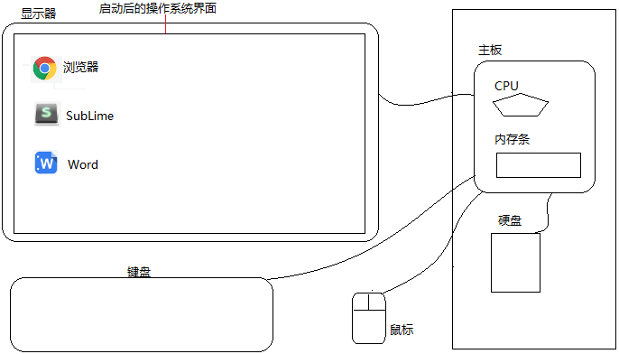
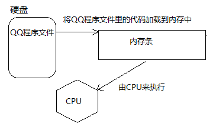
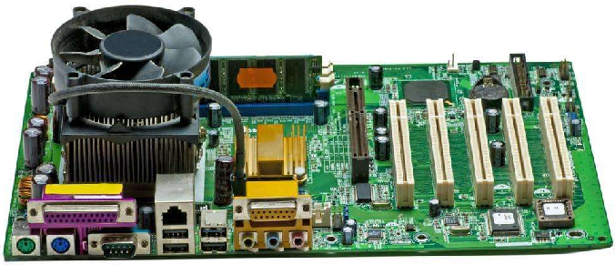
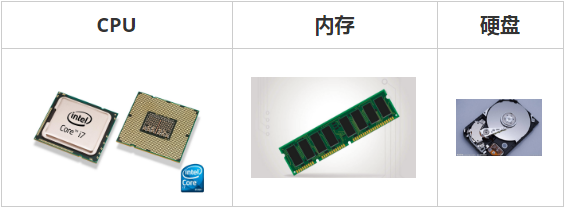

> 第02阶段.前端基本功.前端基础.入门语法

# 系统知识补充

## 学习目标
* 理解
  * 计算机组成
  * 认识计算机内存

## 一. 核心内容

### 1. 计算机组成

#### 1.1 软件（程序）

- 系统软件：Windows、Linux、macOS
- 应用软件：浏览器(Chrome/IE/Firefox)、QQ、VSCode、Sublime、Word

#### 1.2 硬件

- 1.21   三大件：
  - CPU、内存、硬盘，而 主板 是起到连接主要硬件的作用 
    - 主板：起到连接各个硬件桥梁作用
    - CPU（中央处理器）
      - 负责处理数据与运算
      - 负责通过几十个针脚连接控制主板上不同的硬件
    - 内存条
      - 临时存放数据，断电后不能保存数据
      - 读写速度很快
      - 空间小（单价高） 4g  8g 16g
    - 硬盘
      - 永久储存数据，断电后依然保存数据
      - 读写速度较慢
      - 空间大（单价低) 
- 1.2.2 输入设备：
  - 鼠标、键盘、手写板、摄像头等
- 1.2.3 输出设备：
  - 显示器、打印机、投影仪等




#### 1.4 程序运行介绍

+ 关于二进制简述

  简单来说 用 0 和 1 来表示数据。具体的说，是用 0 和 1 的各种不同组合 代表 不同的数据，如

```` js
0=00000000   1=00000001   2=00000010   3=00000011   4=00000100   5=00000101
6=00000110   7=00000111   8=00001000   9=00001001   10=00001010
````

+ 各种进制的数值 可以 通过 算式 换算（计算）出来

> 思考：那如果要表达字母文字呢？
> 解答：可以用数字代表字母，比如  65 代表 A。为了统一这个代表的过程，美国标准组织 制定了 ASCII编码表，见附件。
>            也就是说，字母 -> 数字 -> 二进制 -> 计算机

+ 关于数据储存
  + 所有数据，包含文件、图片等最终都是以二进制数据（0 和 1）的方式存放在硬盘中
  + 所有程序，包括操作系统，本质都是各种数据，也以二进制数据的方式存放在 硬盘里。平时我们所说的安装软件，其实就是把程序文件复制到硬盘中
  + 硬盘、内存都是保存的 二进制数据
+ 关于数据存储单位（bit < byte < kb < GB < TB<.....）
  + 位：1bit 可以保存一个 0 或者 1
  + 字节：1byte = 8bit
  + 千字节：1kb = 1024byte
  + 兆：1mb = 1024kb
  + 1GB = 1024mb
  + 1TB = 1024GB
+ 关于运行
  + 打开某个程序时，先从硬盘中把程序的代码加载到内存中
  + CPU执行内存中的代码
  + 注意：之所以要内存 的一个 重要原因，是因为 cpu 运行太快了，如果只从硬盘各种读数据，会浪费cpu性能。所以，才使用 存取速度更快 的 内存 来 保存 运行时 的数据。



> **系统是个大软件程序：**我们开启电脑后，由主板内置的bios程序来启动操作系统，这时会把硬盘里的操作系统启动代码加载到内存中并执行代码，然后由系统通过主板控制显示器显示界面。

### 2  硬件真实模样

+ 主板



+ CPU 内存条 硬盘



### 3  为什么内存读写比硬盘快? 

+ 硬盘是有机械结构的，磁头要运动到相应的位置，转片还在转动，然后读取磁信号。

+ 内存是没有机械结构的，是电，瞬间到达。电的到达速度要比磁头的运动快得多，比盘算转动也快得多。所以，有机械结构的磁头的读取速度是不能和无机械结构电的速度相比的。

+ 补充：固态硬盘，硬盘一般分为机械硬盘和固态硬盘。固态硬盘使用的是闪存，比机械硬盘的磁盘要快得多，但也不能和真正的RAM去比速度。


