> 第02阶段.前端基本功.前端基础.入门语法

# 基础语法

## 学习目标
* 理解
  * 掌握 JS 三种书写位置 和 注释
  * 能用自己的话解释变量与数据类型概念
  * 能说出常见的数据类型
  * 算数运算符和自增自减
* 应用
  * 能编写输入输出代码
  * 能编写“问好案例”
* 推荐在线学习网站
  * 由于前端开发正处于高速进化期，语法和框架更新都较快，有需要可以通过权威网站来了解
  * MDN：https://developer.mozilla.org/zh-CN/

## 一.核心内容

前置讲解：alert() 方法，console.log()方法，prompt()方法 -- 详细可查看 9

## 1. JS代码书写位置

> 联想：CSS 样式的书写方式？

JS的书写位置如样式表一样有3种书写位置，分别为 *行内、内部、外部* 

### 1.1 行内 JS

+ 可以将 **单行或少量JS代码** 写在HTML标签的事件属性（以 `on` 开头的属性），如：`onclick`
+ 注意单双引号的使用：在HTML中我们推荐适应双引号

````html
<input type="button" value="点我试试" onclick="alert('Hello World')" />
````

**缺点：**

+ 可读性差， 在html中编写JS大量代码时，不方便阅读；
+ 引号易错，引号多层嵌套匹配时，非常容易弄混；

### 1.2 内嵌 JS 

+ 可以将 **多行JS代码** 写到 `<script>` 标签中

````html
<head>
  <script>
    alert('Hello  World~!');
  </script>
</head>
````

+ 内嵌 JS 是学习是常用的方式

### 1.3 外部 JS 文件

+ 利于HTML页面 代码结构化，把大段 JS代码 独立到 HTML页面 之外。既美观，也方便文件级别的复用：

  从而让 不同的 HTML页面 可以 引入 同一个 JS文件。

````html
<script src="outdoor.js"></script>
````


 **注意：**引用外部 js 文件的 script 标签中不可以写代码

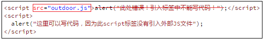

### 1.4 小结

+ 三种JS书写位置：行内、内嵌标签 ( 学习期间 推荐 )、外部引入 ( 工作后看情况 )


## 2.注释

> HTML 和 CSS 中 我们不需要浏览器显示的  我们可以通过注释 ，那么JS中呢？

### 2.1 单行注释

+ 用来注释单行文字（  快捷键   ctrl  +  /   ）

```` javascript
// 我是一行文字，不想被 JS引擎 执行，所以 注释起来
````

### 2.2 多行注释

+ 用来注释多行文字（   快捷键    alt +  shift  + a   ）  

```` javascript
/*
  获取用户年龄和姓名
  并通过提示框显示出来
*/
````

学会修改为   ctrl + shift  +  /  

## 3.变量

### 3.1 为什么要用变量

我们CSS 中，.red { color : red;}    一次声明， 多次调用     非常方便

同样，我们页面中，有很多的数据，我们需要多次使用， 我们可以把这个数据保存起来，多次调用就好了。

这就可以用到变量了。

总结目的：  一次存储，多次使用

### 3.2 什么是变量？


+ 通俗：变量就是一个装东西的盒子
+ 概念：变量是用于存放数据的**容器**，里面的数据我们可以多次使用，甚至数据可以修改
+ 本质：变量是程序在 内存 中申请的一块用来存放数据的 空间


内存原理图：

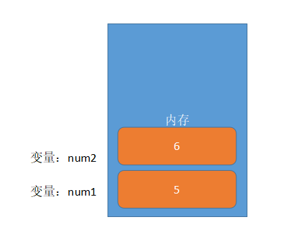

仓库有了，也保存了，我们应该  能找到他们，所以，应该找个名称 来区别每个 存放的小盒子 （容器）

### 3.3 变量的使用

#### 3.2.1 变量的使用分为2步

```JavaScript
//  1.  声明变量  
var  age ; //  声明一个 age 的变量     var 是 一个 JS关键字，用来 声明变量
//  2.  赋值
age  = 10; // 给 age  这个变量赋值为 10     此时的 =  不是数学中的等号  
```

- 详解

  - `var` 是 一个 JS关键字，用来 声明变量   ( variable 变量的意思 )     电脑会自动分配内存空间，不需要我们管。

  - `age` 是 程序员定的 **变量名**，但是我们程序员要通过 变量名 来访问这个空间。

    ​         PS：变量名 在代码执行时都换成了变量空间的内存地址

  - `= ` 用来把 右边的值 赋给 左边的 变量空间中  **此处的= 不是数学中的等号 此处代表赋值的意思**

  - `变量值` 是程序员保存到变量空间里的值

- 变量使用注意点 

  | 变量使用注意点          |                                                       |
  | ----------------------- | ----------------------------------------------------- |
  | 只声明 不赋值           | var  age ;        console.log (age);     // undefined |
  | 不声明 不赋值  直接使用 | console.log(age) ;   //  报错                         |
  | 不声明 只赋值           | age   = 10;  console.log(age);   // 10  不推荐这样写  |

#### 3.2.2 声明变量，并赋值( 推荐写法 )

+ 语法：`var 变量名 = 变量值;`

```javascript
var age = 10;
```
声明一个变量并赋值， 我们也称为变量的初始化。

####  3.2.3 变量内部值的更改

 一个变量被重复赋值后它原有的值是会被覆盖， 以最后一次赋值的值为准

~~~javascript
var  age = 10;
age = 20;
最后的结果就是  20   因为 10 覆盖掉了
~~~

### 3.4 语法扩展

- 同时声明多个变量

```javascript
var age, name, sex;  // 等价于   var  age;  var name; vae sex;
age = 10;
name = 'zs';
sex = 2;
```

- 同时声明多个变量并赋值
```javascript
var age = 10, name = 'zs',sex = 2;
```
+ 声明后同时给多个变量赋值

```` js
var age,name,sex;
age = name = sex = 120;
````

### 3.5 总结变量在内存中的存储

~~~
var age = 18;
var name = 'sz';
~~~


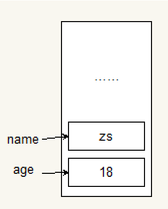

### 3.6 变量命名规则和规范

- **规则** 必须遵守的，不遵守的话 JS引擎 发现并报错

  > 规则 相当于人类社会的法律，犯法就坐牢

  - 由字母(A-Za-z)、数字(0-9)、下划线(_)、美元符号( $ )组成，如：`var usrAge, num01, _name`
  - 区分大小写 `强调：JS 严格区分大小写` ，`var app;` 和 `var App;` 是两个变量
  - **不能** 以数字开头
  - **不能** 是关键字、保留字 和 代码符号，例如：var、for、while、&

  ```` js
  // JS 区分大小写，所以当 大小写 不一样时，JS引擎 会认为是两个变量
  var age = 1;
  var Age = 2;
  alert(age + Age);
  ````


- **规范**  建议遵守的，不遵守的话 JS引擎 也不会报错

  > 规范 相当于 人类社会的 道德，违反了不会有警察找你，但任何人都可能指责你  

  - 变量名必须有意义

  - 遵守驼峰命名法。首字母小写，后面单词的首字母需要大写。

    如：`usrName` 和 `usrPassword`      和    `xian`   和 ` xiAn`

 
> **提问：以下哪些变量名不合法**


|第一组|第二组|第三组|
|:---|:----|:---|
|var a|var userName|var theWorld|
|var 1|var $name|var the world|
|var age18|var _sex|var the_world|
|var 18age|var &sex|var for|

> **课堂案例** 5分钟
> 要求：交换两个变量的值 ( *实现思路：使用一个 临时变量 用来做中间存储* )

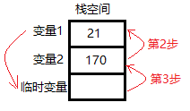

### 3.7 小结

+ 变量 是内存里的一块空间，用来存储数据， 方便我们以后使用里面的数据。

+ 我们使用变量的时候，一定要声明变量，并且赋值。

+ 变量名尽量要规范，见名知意。


## 4. 数据类型简介

### 4.1 什么是数据类型？

所有变量都具有数据类型，以决定能够存储哪种数据。比如 名字  “张三”     比如 年龄  18      这些数据的类型是不一样的。

### 4.2 变量属于那种数据类型？

+ 在代码运行时，由 `JS引擎` 根据 `=` 右边 ` 变量值的数据类型` 来判断的

```` javascript
var age = 10; //  这是一个数值型
var areYouOk = '是的'; //这是一个字符型
````

运行完毕之后， 变量就确定了数据类型

**我们JavaScript是弱数据类型，变量是没有固定数据类型的， 总之，你给变量一个什么值，它就是什么数据类型的变量。**

## 5. 简单数据类型

> JavaScript 中的数据类型 分两类：**简单数据类型** 和 **复杂数据类型**，我们今天讲 简单数据类型

| 简单数据类型     | 说明            | 默认值 |
| :------- | ----------------- | :------- |
| Number | 数值类型，包含 整型值和浮点型值，如 21、0.21 | 0 |
| Boolean | 布尔值类型，如 true 、false，等价于 1 和 0 | false |
| String | 字符串类型，如 "张三"   注意咱们js 里面，字符串都带引号 | "" |
| Undefined | var a;   声明了变量a 但是没有给值，此时 a = undefined | undefined |
| Null | 表示空的对象 | nul |

### 5.1 Number 数值类型

+ JavaScript 只有一种数字类型，既可以用来保存 `整数值`，也可以保存 `小数 `  

+ 数值字面量：数值的固定值的表示法

  110 1024  60.5

```` javascript
var usrAge = 21;// 整数
var doubleNum = 21.3747;// 小数
````

 这个小数，我们也成为 浮点小数

#### 5.1.2  数值的进制

```javascript
//1.十进制
	var num = 9;
    // 进行算数计算时，八进制和十六进制表示的数值最终都将被转换成十进制数值。

//2.八进制 数字序列范围：0~7
    var num1 = 07;   // 对应十进制的7
    var num2 = 019;  // 对应十进制的19
    var num3 = 08;   // 对应十进制的8

//3.十六进制 数字序列范围：0~9以及A~F
	var num = 0xA;
    //如果字面值中的数值超出了范围，那么前导零将被忽略，后面的数值将被当作十进制数值解析
```

#### 5.1.3. 浮点数的精度问题

- 浮点数值的最高精度是 17 位小数，但在进行算术计算时其精确度远远不如整数。
  注意：了解即可，不用纠结。
- 比如 价格：  8.8

```javascript
var result = 0.1 + 0.2;    // 结果不是 0.3，而是：0.30000000000000004
console.log(0.07 * 100);   // 结果不是 7，  而是：7.000000000000001
// 所以：不要直接判断两个浮点数是否相等 !
```

#### 5.1.4 数值范围

- JavaScript中 数值的最大和最小值
  + 最大值：`Number.MAX_VALUE`，这个值为： `1.7976931348623157e+308`
  + 最小值：`Number.MIN_VALUE`，这个值为：`5e-324`

```` js
alert(Number.MAX_VALUE); // 1.7976931348623157e+308
alert(Number.MIN_VALUE); // 5e-324
````

+ 三个特殊值

  无穷大：`Infinity` ，代表无穷大，大于任何数值

  ​		任何 正值乘以 Infinity 为 Infinity

  ​		任何数值（除了Infinity 和 -Infinity）除以 Infinity 为 0

  无穷小：`-Infinity` ，代表无穷小，小于任何数值

  非数值：`NaN` ，Not a number，代表一个非数值

````js
alert(Infinity); // Infinity
alert(-Infinity); // -Infinity
alert(NaN); // NaN
// 也不要 用 NaN 相比较 
````

#### 5.1.3 isNaN(x) 方法

+ 用来判断一个变量是否为`非数值` 的类型

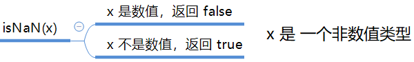

> **课堂练习：** 5分钟
> 要求：编写如下代码并运行，注意 isNaN() 返回的值

````javascript
var usrAge = 21;
var isOk = isNaN(userAge);
console.log(isNum); // false ，21 不是一个 非数值

var usrName = "andy";
console.log(isNaN(userName));//true ，"andy"是一个 非数值
````

### 5.2 Boolean 布尔类型

- 布尔类型有两个值：true 和 false

  ​


### 5.3 String 字符串类型

+ 用于表示 `文本数据` ，语法为 双引号 `""` 和 单引号` ''`

```` javascript
var strMsg = "我爱北京天安门~";  // 使用 双引号 表示字符串
var strMsg2 = '我爱广州小蛮腰~'; // 使用 单引号 表示字符串

// 常见错误
var strMsg3 = 我爱上海黄浦江;    // *报错*，没使用引号，会被认为是 js代码，但js没有这些语法
````

#### 5.3.1 字符串的嵌套

如何显示 `我是"高帅富"程序猿` ？（注意里面包含一对双引号）

```` javascript
var strMsg = '我是"高帅富"程序猿';  // 可以用   '' 包含 ""
var strMsg2 = "我是'高帅富'程序猿"; // 也可以用 "" 包含 ''

// 常见错误
var badQuotes = 'What on earth?"; // *报错*，不能 单双引号搭配
````

+ JS 可以 用 单引号 嵌套 双引号 ，或者 用 双引号 嵌套 单引号 (外双内单，外单内双)
+ 那开发时，到底用 单引号还是双引号 来表示字符串呢 ？
+ **规范 统一用** `单引号` 


#### 5.3.2 字符串转义符

- 不能在字符串中包含相同的引号   (单引号中不能再嵌套单引号 双引号中不能再嵌套双引号)

下面将会出现错误，因为它会混淆浏览器和字符串的结束位置：

```` javascript
// 请注意 i'm 中的 单引号
var badQuotes02 = 'I'm the GOD of my world ~!'; // 报错！
````

示例详解：

 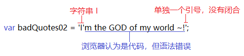

- 使用 转义字符 可以让单引号中嵌套单引号。   （也可以让双引号中嵌套双引号）
- 定义： 可以将某些具有特殊功能的字符转换为没有特殊功能的字符

​         在JavaScript中，我们通过在 `不需要特殊功能的字符之前` 放一个 `反斜杠` 来实现这一点。看看这个：

````javascript
var strMsg = 'I\'m the GOD of my world ~!'; //输出：I'm the GOD of my world ~!
var strMsg2 = "I\"m the GOD of my world ~!"; //输出：I"m the GOD of my world ~!
var strMsg3 = '反斜杠是这个 \\，神奇！';  //输出：反斜杠是这个 \，神奇！
````

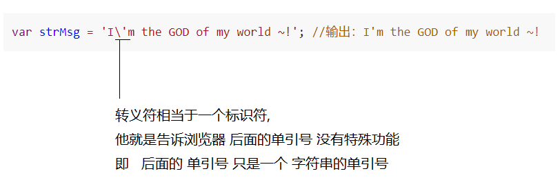

> **课堂练习**  用时：5分钟
>
> 要求：1.用字符串变量 var strMsg 保存 这句话： I'm Rookie，我爱锻炼，因为不想"猝死"~！
> ​           2.使用 alert 显示，如下图：

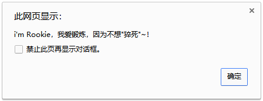


你可以用别的方式来达到一样的目的， 例如. `\",` 除此之外有一些特殊的代码 ，常见如下表：

| 字面量 | 含义     |
| ------ | -------- |
| \n     | 换行符（重要）      newline |
| \ \    | 斜杠 \   |
| \'     | 单引号 ' |
| \"     | 双引号 " |
| \t     | Tab      |
| \b     | 空格   blank |
| \r     | 回车符   |

​	**注意：** `\n` 和 `\r` 都起到换行的作用，但平时用 `\n` 比较合适。因为 `\n` 是 windows/mac/ninux 都支持，`\r` 只有 windows 支持。

> **课堂练习** 
> 要求：编写一个字符串变量，用 alert 方法 显示如下图：
>
> 站在广州小蛮腰之上,
> 忍不住大声喊道 :"论苍茫大地,谁主沉浮?"
> '扑通'一声,太激动,摔倒椅子了......


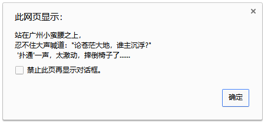


#### 5.3.3 字符串的长度

字符串是若干 `字符` 组成的 `串`，这些 *字符的数量*  就是 *字符串的长度*。 `我` `是`  `字` `符` `组` `合` ` 而` ` 成` `的 ` `！` 

字符串的 `length` 属性可以获取 ` 整个字符串` 的长度

```` javascript
var strMsg = "我是帅气多金的程序猿！--- 恩，我看出了你的自信。";
alert(strMsg.length); // 显示 26
````

#### 5.3.4 字符串的拼接

多个字符串之间可以使用 `+号` 进行拼接

**注意：** 区分 **字符串拼接** 与 **数值运算**

+ 字符串 + 任何类型 = 拼接之后的新字符串
  拼接前 会把 与字符串 相加的 任何类型 转成 字符串，再拼接成一个新的字符串

```` javascript
//1.1 字符串 "相加"
alert('hello' + ' ' + 'world'); // hello world
//1.2 数值字符串 "相加"
alert('100' + '100'); // 100100
//1.3 数值字符串 + 数值
alert('11' + 12); // 1112
//1.4 字符串 + 布尔值
alert('male：' + true); // male：true
//1.5 字符串 + NaN
alert('非数值：' + NaN); // 非数值：NaN   
````

总结 +  口诀：

​    数值相加    字符相连  

> **课堂练习**  用时：5分钟
> 要求：练习并体验上例代码
>
> 弹出一个框， 需要用户输入年龄 ， 之后弹出一个警示框 显示   强哥 xx 岁了    （xx 表示 刚才输入的年龄）


### 5.4 Undefined 未定义类型

+ 一个声明后没有被赋值的变量会有个默认值 undefined。

```` javascript
var usrName; // 声明变量后没有直接赋值，此时它的默认值就是 undefined
alert(usrName); // 显示 undefined
````

### 5.5 Null 空对象类型

+ null类型被看做空对象，它只有一个值，即 null 值

```` javascript
var usrObj = null;
alert(usrObj); // 显示 null
````

+ 如果你定义了一个变量，但是想在以后把这个变量当做一个对象来用，那么最好将该对象初始化为 null 值
+ 如果你想把一个对象占用的内存释放掉，办法之一就是把这个变量设置为 null

> 变量的值如果想为null，必须手动设置；当然 JS引擎  也会在释放对象空间后把变量设置为 null。

### 5.6 获取变量的数据类型

+ typeof 可用来获取变量的数据类型
+ 语法：

```` javascript
var num = 3747;
var isNum = typeof num; // 也可以 写成 typeof(num)
alert(isNum); // "number"
````

+ 不同类型返回值。

| 类型         | 例                 | 结果                             |
| ------------ | ------------------ | -------------------------------- |
| String       | typeof "小白"      | "string"                         |
| Number       | typeof 3747        | "number"                         |
| Boolean      | typeof true        | "boolean"                        |
| Undefined    | typeof undefined   | "undefined"                      |
| **Null**     | **typeof null**    | **"object"**   这是个历史遗留bug |
| 函数         | typeof alert;      | "function"                       |
| 任何其它对象 | typeof  new Date() | "obejct"                         |

### 5.6 小结

+ Number ：JS中的数值类型变量 可以保存 整型数值 和 浮点型数值
  + isNaN()
+ String ：字符串用 ``` `  和 `""` 都可以，但前端开发统一规范使用 单引号 `var usrName ='字符串值'`
  + 多个字符串可以用 `+` 号相拼接
  + length属性获取字符串长度
  + 转义符
+ Boolean：布尔值 用 `true ` 和 `false`
+ Undefined：声明后未赋值的变量的默认值
+ Null：空对象
+ 可用 typeof 获取 数据类型
+ chrome显示 字符串的颜色是黑色的，数值类型是蓝色的，布尔类型也是蓝色的，undefined和null是灰色的

## 6. 字面量

在源代码中一个固定值的表示法。

通俗点   字面量表示如何表达这个值，一般除去表达式，给变量赋值时，等号右边都可以认为是字面量。

数值字面量：8, 9, 10

字符串字面量：'黑马程序员', "大前端"

布尔字面量：true，false

## 7.数据类型转换

字符串的颜色是黑色的，数值类型是蓝色的，布尔类型也是蓝色的，undefined和null是灰色的

**我们表单获取过来的数据默认是字符型的，此时就不能直接简单的 进行  加法运算。 此时需要转换。**

通俗：就是把一种数据类型的变量转换成另外一种数据类型

通过调用系统函数进行类型转换，主要分3类：转 `字符串`、转 `数值`、转 `布尔值`

### 6.1 转换为字符串

| 方式              | 说明                         | 案例                                |
| ----------------- | ---------------------------- | ----------------------------------- |
| toString()        | 把变量转成字符串             | var num= 1;  alert(num.toString()); |
| String() 强制转换 | 把特殊值转成字符串           | String(undefined);                  |
| 加号拼接字符串    | 和字符串拼接的结果都是字符串 | var str = 215 + "我是字符串";       |

+ toString() 方法

  toString() 方法可把一个逻辑值转换为字符串，并返回结果

  布尔类型的 toString() 只会输出 "true" 和 "false"

````javascript
var isFound = false;
alert(isFound.toString()); // 输出"false"
````

````javascript
var num01 = 27; // alert(num01)输出"27"
var num02 = 27.37; // alert(num02)输出"27.37"
console.log(num01.toString())
````


+ String() 方法

  String()函数存在的意义：有些值没有toString()，这个时候可以使用String()。
  比如：undefined 和 null

~~~javascript
var  timer = null;
console.log(String(timer));
~~~


+ 加号拼接字符串

  当 + 两边 一个是 `字符串类型`，另一个是 `其它类型` 的时候，会先把 `其它类型` 转换成 `字符串` 再进行**字符串拼接**，最后返回字符串

  ````javascript
  alert(21 + "小白"); // 输出"21小白"
  alert(false + "小白"); // 输出"false小白"
  ````

> **提问：** alert(167 +  "90") 输出的是什么呢？

### 6.2 转换为数值(重点)

我们前面说过，表单获取过来的数据默认是字符型，我们需要转换为数值型。

| 方式                    | 说明                       | 案例                |
| ----------------------- | -------------------------- | ------------------- |
| parseInt(string) 函数   | 将string类型参数转成整数   | parseInt('78')      |
| parseFloat(string) 函数 | 将string类型参数转成浮点数 | parseFloat('78.21') |
| Number() 强制转换函数   | 将string类型参数转成浮点数 | parseFloat('78.21') |

+ parseInt(string) 函数

**概念：** 将 数值字符串 转成 整数数值

````javascript
var numAge = parseInt("912"); // 912
````

**执行规则：**

````javascript
//规则1.永远记住它是取整函数
var numLove = parseInt(18.08); // 18
var numLove = parseInt(18.88); // 18

//规则2.如果第一个字符不是数字符号或者负号，返回NaN
var numLove = parseInt("aboard211"); // NaN

//规则3.如果第一个字符是数字，则继续解析直至字符串解析完毕 或者 遇到一个非数字符号为止
var numLove = parseInt("520littlecat"); // 520
````

> **提问：**
>
> 1. var numLove = parseInt("abc12.3")  执行后 numLove 的值是什么？
> 2. var num = parseInt("12.3abc")  执行后 num 的值是什么？

+ **parseFloat(string)函数**


**概念：** 将 浮点数值字符串 转成 浮点数值

````javascript
var num = parseFloat("12.3abc"); // 12.3
````

注意：parseFloat函数如果用来转换 整型数值字符串，则也是返回 整型数值

````javascript
var num = parseFloat("12"); // 12，而不是 12.0
````

* **Number() 强制转换函数**

  * 里面如果只要出现非数字字符或者undefined， 则就返回	 NaN
  * 如果该值是空字符串、数字0、或null、false   则返回 0     如果是 true  则返回 1 

* **利用js变量弱类型转换**

  利用了js的弱类型的特点，只进行了算术运算，实现了字符串到数字的类型转换，不过这个方法还是不推荐的

~~~javascript
var   str= '123 ';
var   x   =   str-0;
var   x   =   x*1; 
~~~

**总结**

以上4种方法，我们用的最多的是 parseInt()  和  parseFloat ();

**课堂练习：**

计算年龄， 弹出一个输入框，我们输入出生年份， 能计算出我们的年龄。

~~~javascript
   var age = prompt('请输入您的出生年份：')
   // 因为此时的age 用到了 减法， 就不用转换为数值了
   var result = 2018 - age
   alert('您今年已经：' + result + '岁了');
~~~

课堂案例演示：加法计算器V0.01版本

计算两个数的值， 用户输入第一个值， 继续弹出输入第二个值， 最后弹出两者的结果。

### 6.3 转换为Boolean值

| 方式          | 说明                   | 案例             |
| ------------- | ---------------------- | ---------------- |
| Boolean()函数 | 将布尔字符串转成布尔值 | Boolean('true'); |

+ 代表 空、否定的值 会被转换为 false 有五种  “ ''、0、NaN、null、undefined
+ 其余任何值都会被转换为 true

```` js
var res = Boolean(''); // false
res = Boolean(0); // false
res = Boolean(NaN); // false
res = Boolean(null); // false
res = Boolean(undefined); // false

var res2 = Boolean('小白'); // true
var res2 = Boolean(12); // true
````

  > 学习提醒：请同学们不要去背上面一句，大概有个印象就行。

## 8. 运算符（上）

有时候也成为操作符  operate

### 8.1 算数运算符

是完成基本算数运算使用的符号，用来处理四则运算

| 运算符 | 描述         | 实例                     |
| ------ | ------------ | ------------------------ |
| +      | 加           | 10 + 20 = 30             |
| -      | 减           | 10 - 20 = -10            |
| *      | 乘           | 10 * 20 = 200            |
| /      | 除           | 10 / 20 = 0.5            |
| %      | 取余数(取模) | 返回除法的余数 9 % 2 = 1 |


**例子：**
```` js
var res = 15 + 6;
res = 21 - 15;
res = 3 * 5;
res = 10 / 20;
res = 9 % 2;  
````

> 课堂提问？ 

我们怎么判断 一个数能够被整除呢？

### 8.2 一元运算符

一些只需要一个操作数的运算符称为一元运算符。  比如 +15    -15  正负    还有  ++  和   --  

### 8.2.1 前置运算(理解)

在 JavaScript 中，`++` 和 `--` 既可以放在变量前面，也可以放在变量后面。以自增举例：

- `++num` **前置自增** ：先自加  后运算 

```` javascript
var num = 7;
alert(++num); // 8
alert(num);   // 8

````

图解：

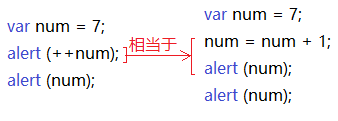

~~~javascript
var  num = 10;
alert(++num + 10);
~~~


###  8.2.2 后置运算(重点)

- num++` **后置自增**：先  原值运算    后 自加 

```` javascript
var num = 7;
alert(num++); // 7
alert(num);   // 8
````

图解：

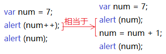


~~~javascript
var  num = 10;
alert(10 + num++);
~~~

**课堂练习：**

~~~javascript
var a = 10;
++a;
var b = ++a + 2;
console.log(b);

var c = 10;
c++;
var d = c++ + 2;
console.log(d);
~~~


**猜猜看**

```javascript
var a = 1; var b = ++a + ++a; console.log(b);    
var a = 1; var b = a++ + ++a; console.log(b);    
var a = 1; var b = a++ + a++; console.log(b);    
var a = 1; var b = ++a + a++; console.log(b);  
```


### 8.2.3 自增自减运算符 小结

* `++` 和 `--` 运算符目的可以简化代码的编写，让变量的值 `+ 1` 或者 `- 1`；


* 单独使用时，运行结果相同；
* 与其他代码联用时，执行结果会不同
* **后置**：先  原值运算    后 自加 
* **前置**：先自加  后运算 
* **开发时**，**大多使用后置自增/减，并且代码独占一行**，例如：`num++;` 或者 `num--;`。
* 开发时，不要和其他代码联用 —— 会降低代码的**可读性**

**不易读的代码示例**：

```` js
var a = 1;
var b = ++a + ++a; // 此处 和 +号 同时使用，会影响 到 后面 ++a 的执行过程
alert(b); // 5
````

## 9. 基础输入输出

> 为了方便JS基础入门课程的学习，我们在此教大家简单使用的输入输出方式

+ 所谓 **输入**，就是 **用代码** **获取** 用户 **键盘** 等硬件 输入的信息，如：去银行取钱，在 ATM 上输入密码
+ 所谓 输出，就是 用代码 显示数据 给用户看。
+ 我们本节获取用户在 **键盘** 上的输入信息，需要使用到浏览器 `prompt` 函数

### 9.1 关于函数（Function） 

> 此节只需简单了解函数用法，后面有专门课程详解函数

- 一个 **提前准备好的功能**（别人或者自己写的代码），**可以直接使用**，而 **不用关心内部的细节**
- 如今天要学的以下4个函数：

|函数|说明|归属|
|----|:----|----|
|alert(msg)| 用浏览器提示框显示msg |浏览器提供|
|prompt(info)| 用浏览器对话框接收用户输入，info是提示信息 |浏览器提供|
|*console.log(msg)| 用浏览器控制台显示msg |浏览器提供|
|*Math.random()| 获取随机小数 x，0<= x <1 |JS语法内置|

### 9.2 alert() 显示消息

- 消息弹出窗：在 JS 中可以使用浏览器提供的 `alert` 函数 显示消息
- 语法如下：

```` javascript
var usrMsg = "请问有空吗？"
alert(usrMsg);
````
> **思考： 如何显示 用户输入的数据？**

### 9.3 prompt(info) 获取输入

- 消息输入窗：在 JS 中可以使用浏览器提供的 `prompt` 函数从键盘接收用户的输入
  - 括号中的参数 info 是用来显示在输入窗给用户看的提示信息
- 用户输入的 **任何内容** 都是一个 **字符串**
- 语法如下：

```` javascript
var usrMsg = prompt();
var usrName = prompt('请输入您的名字'); //会在输入窗显示给用户看的提示信息
alert(usrName); // 打印用户名字
````

> 课堂案例演示：加法计算器V0.01版本

```` js
// 在浏览器控制台 显示 欢迎消息
alert("欢迎使用 加法计算 ！");
// 获取 用户输入 的 第一个数
var num01 = prompt("请输入第一个数："); // 注意：prompt 获取的用户输入都是字符串类型
num01 = parseFloat(num01); // 将 用户输入的数值字符串 转成 数值类型

// 获取 用户输入 的 第二个数
var num02 = prompt("请输入第二个数：");
num02 = parseFloat(num02); // 将 用户输入的数值字符串 转成 数值类型

// 计算两数之和
var sNum = num01 + num02;
// 按照 1 + 1 = 3 的格式 显示
alert('最后的结果是'+ sNum); // 用 + 号拼接字符串
````

> 课堂练习：10分钟
> 要求：编写 减法计算器

### 9.4 console.log() 控制台输出

* 360极速浏览器、谷歌浏览器、火狐浏览器、IE11 等新浏览器 支持 `开发者工具`
*  `开发人者工具` 提供一些列浏览器工具来帮助进行 浏览器段代码调试，通过 f12 快速开启
* `console.log(msg)` 可以把 页面JS 执行过程中，把需要的数据 显示在 开发者工具 的 控制台界面，如：

```` javascript
var tempMsg = '50年后，我国是否已统一全球？';
console.log(tempMsg);
````

+ console.log() 输出内容在 浏览器显示的位置：

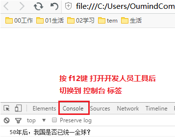

> 有同学说：有了 alert() 为什么还要 console.log() 呢 ？
>
> 回答：alert() 主要用来显示消息给用户，console.log() 用来给程序员自己看运行时的消息。所以实际上用什么都可以，看自己喜欢。

## 二. 扩展内容@

### 1. 数值 toString 的基模式

+ 数值类型 toString() 方法的基模式 可以用不同的进制（基）输出数字
  如：二进制的基是2，八进制的基是8，十六进制的基是16
+ 语法：num.toString(进制基)

```` javascript
var iNum = 10;
alert(iNum.toString(2)); // 输出 "1010"
alert(iNum.toString(8)); // 输出 "12"
alert(iNum.toString(16)); // 输出 "A"
````


### 2. 关键字、保留字、标识符

+ 标识符：就是指开发人员为 变量、属性、函数、参数 取的名字。
  		标识符不能是 `关键字` 或 `保留字`


+ 关键字：是指 JS本身已经使用了，不能再用它们充当变量名啊方法名啊什么的。
  包括：break、case、catch、continue、default、delete、do、else、finally、for、function、if、in、instanceof、new、return、switch、this、throw、try、typeof、var、void、while、with 等。
+ 保留字：实际上就是预留的“关键字”，意思是现在虽然现在还不是关键字，但是未来可能会成为关键字的，你一样是不能使用它们当变量名或方法名。
  包括：boolean、byte、char、class、const、debugger、double、enum、export、extends、fimal、float、goto、implements、import、int、interface、long、mative、package、private、protected、public、short、static、super、synchronized、throws、transient、volatile 等。
+ 注意：如果将保留字用作变量名或函数名，那么除非将来的浏览器实现了该保留字，否则很可能收不到任何错误消息。当浏览器将其实现后，该单词将被看做关键字，如此将出现关键字错误。

## 三. 课后综合练习（作业）

> **1. 不使用临时变量，交换两个数值变量的值**
> ​    思路：两个数值变量的加减运算

> **2. 依次询问并获取用户的 姓名、年龄、性别，并打印用户信息如图。** 

图一：


图二：

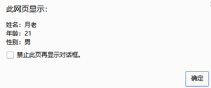

## 四. 深度阅读@

[《详解 ECMAScript 数据类型》](http://www.cnblogs.com/onepixel/p/5140944.html)

[《浏览器内核、渲染引擎、JS引擎》](http://www.cnblogs.com/jameszou/p/8524501.html)

[《浏览器内核与js引擎》](http://www.cnblogs.com/xiyangbaixue/p/4042548.html)